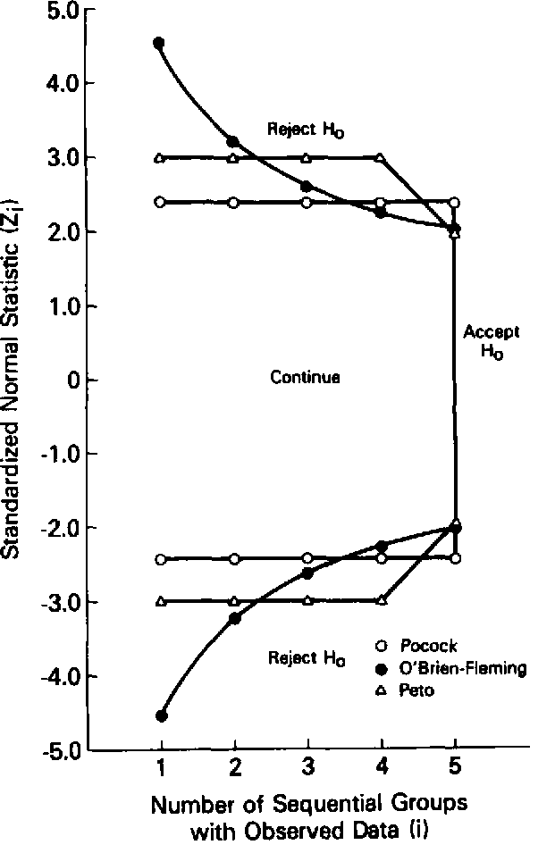
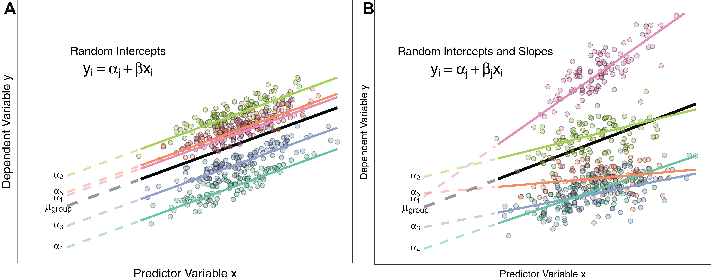
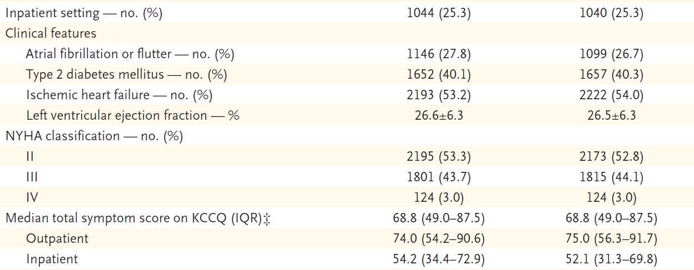
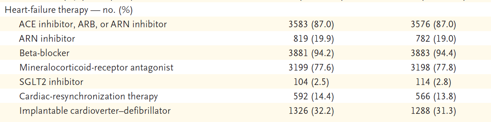
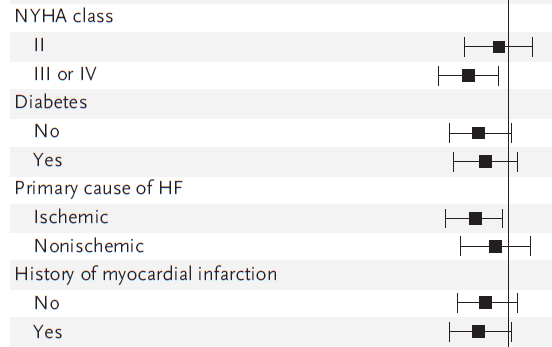
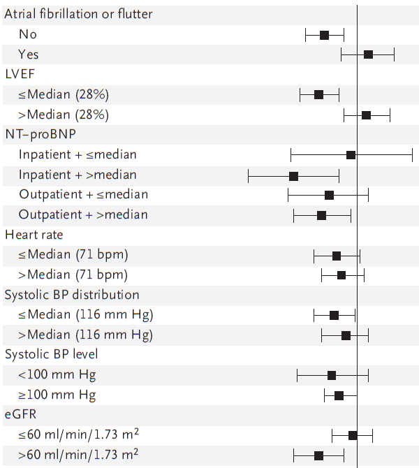
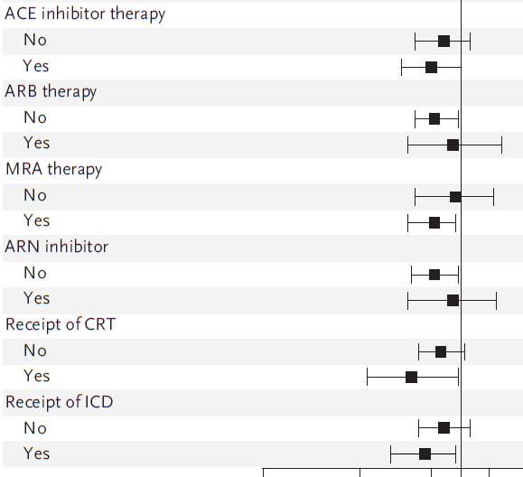
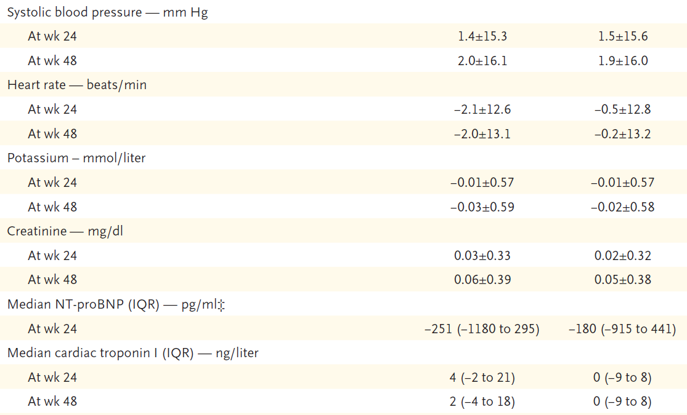
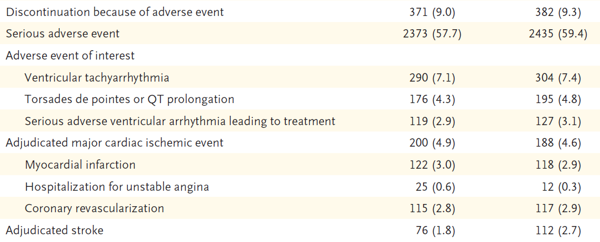

```{r setup, echo=FALSE, include=FALSE}
library(tidyverse)

# Clean printing
print.tbl_df <- function(x, ...) {
	print.data.frame(x, right = FALSE, ...)
	invisible(x)
}

# Options
options(digits = 0)
```

```{r, xaringan themer, include=FALSE, warning=FALSE}
# Xaringan theme
library(xaringanthemer)
style_solarized_light()
```

class: center, middle, inverse
# Introduction

---
## Objectives

1. Obtain a general background in the cellular mechanics of myocardial contractility 

1. Be aware of the current pharmacological therapies for improving myocardial inotropy

1. Understand the methods and statistical techniques in survival analysis and mixed models.

1. Critically assess the results of a randomized clinical trial

---
## Study Overview

**GALACTIC-HF** = Global Approach to Lowering Adverse Cardiac Outcomes Through Improving Contractility in Heart Failure

.pull-left[
#### Intervention
- Selective cardiac myosin activator, **omecamtiv mecarbil (OM)**, improves cardiac function
- Randomized to medicine or placebo

#### Population
- Chronic systolic heart failure on GDMT
]

.pull-right[
#### Methods
- Long-term follow-up (median ~ 2 years) for all events

#### Outcomes
- Heart-failure recurrence or cardiovascular mortality

]

---
class: center, middle, inverse
# History and Background

---
## Systolic Heart Failure

- Characterized from dysfunction or loss of cardiomyocytes, resulting in...
	- Reduced contractility
	- Increased cardiac wall stress
- Compensatory mechanisms include:
	- neurohormal activation (both acute autonomic changes and persistent hormonal changes)
	- ventricular remodeling (leading to a negative feedback cycle of ever increasing myocardial oxygen demand and decreased efficiency)

#### Treatment

Currently majority of drugs focus on blocking neurhormonal activation, not on improving systolic function directly.

---

.pull-left[
### Calcitropes for inotropy

Calcitropes (raises intracellular $Ca^{++}$) have been the mainstay of improving systolic function.

Examples:
- Milrinone
- Dobutamine
- Digoxin
- Xamoterol
- Flosequinan
- Pimobendan
- Ibopamine
- Vesnarinone
- Enoximone

]

.pull-right[
### Others
- Angiotensin-converting-enzyme inhibitors (ACEI)

- Beta-adrenergic receptor blockers (BB)

- Mineralocorticoid antagonists (MRA)

- Angiotensin receptor-neprilysin inhibitors (ARNI)

- Sodium-glucose cotransporter 2 inhibitors (SGLT2) 
]

---

background-image: url("calcitropy-failure.png")
background-size: contain

---
## Omecamtiv Mecarbil


---
background-image: url("actin-mechanism.png")
background-size: contain

---
background-image: url("actin-sliding.png")
background-size: contain

---
class: center, middle, inverse
# Methods

---

.pull-left[
### Inclusion
- Eligibility age between 18 - 85 years 
- NYHA $\geq$ II
- LVEF $\leq$ 35%
- Inpatients or outpatients with hospitalization within last 1 year
- Sinus rhythm
  - NT-proBNP $\geq$ 400 pg/mL
  - BNP $\geq$ 125 pg/mL
- Atrial fibrillation/flutter
  - NT-proBNP $\geq$ 1200 pg/mL
  - BNP $\geq$ 375 pg/mL
- Receiving or eligible for GDMT
]

.pull-right[
### Exclusion
- Acute need for hemodynamic support (either chemical or mechanical)
- Systolic pressures $<$ 85 mm Hg
- Indexed GFR $\leq$ 20 mL/min
- Recent ACS or cardiovascular interventional procedure
]

---
### Trial Design

- Randomized in 1:1 ratio of **OM** or **placebo**, with intent-to-treat analysis
- Balanced blocks within strata of enrollment location (inpatient v. outpatient)
- Dosage:
  - Either 25 mg, 37.5 mg, or 50 mg 
  - Dosage based on clearance (plasma levels checked)
  - Post-randomization checks performed at 2-16 week intervals (increasing)
  - Dosing held temporarily in those with ACS

### Outcomes

- Primary: first heart-failure event or CV death composite
- Secondary: CV death, Kansas City Cardiomyopathy Questionnaire (KCCQ), all-cause mortality, MACE

---
## Statistics

- To achieve 90% power to detect $HR=0.80$, expected $N=8000$ subjects and $N=1600$ events
- $\alpha$ spending function with **Haybittle-Peto** approach, with final $\alpha=0.05$
- Evaluated time-to-event using Kaplan-Meier estimates and Cox proportional hazards models
  - Major exposure was trial drug (either **OM** or **placebo**)
  - Stratified with baseline hazards by randomization setting, geographic region
  - Adjusted for baseline GFR
- KCCQ symptom change evaluated using mixed models 
  - Fixed effects: baseline KCCQ, geographic region, GFR, visit, trial group, and interaction between trial group and visit
  - Random effects: randomization setting, repeat visits

---

.pull-left[
### $\alpha$ spending function
- Multiple interim analyses, and multiple secondary outcomes, lead to multiple hypothesis testing
- $\alpha$ can be "spent" in several ways to lead to an overall $\alpha=0.05$ 
- Using *Haybittle-Peto boundary*, can adjust p-value for overall testing
- In this study, 96% of the $\alpha$ was spent on CV death, and 4% on KCCQ/symptom burden, thus a final $\alpha=0.05$ was used

]


.pull-right[

]

---
### Cox Proportional Hazard Models

$$ 
h(t) = h_{0}(t) ^ {\beta1 X1}
$$

- Assumes baseline hazard is proportional between groups
- Covariates are not assumed to vary with time (e.g. GFR is presumed to stay stable)
- Baseline hazard can be stratified 

.center[*Limitations*]

- The hazard is not necessarily proportional, as age and comorbidities are not encompassed
- The hazard ratio may actually be exponential (e.g. **Weibull** distribution - worsening HF will lead to increased events at an accelerating rate)

---
### Mixed Effect Models

- International study with different population/treatment strategies; inpatient/outpatient populations of different risk pools
- Using these as *random effects*, can measure the effect of the intervention and controlling for the differences in populations
- Allows for different slopes (or $\beta$ coefficients) by group



---
class: center, middle, inverse
# Results

---
## Patient Characteristics


- 3% of patient had NYHA IV symptoms

---
## Goal-Directed Medical Therapy


- Rare users of SGLT-2 inhibitors in all groups. 
- Use of ICD are much lower than expected in population with EF $\leq$ 35%
- Only 20% are on ARNI

---
background-image: url("survival-curves.png")
background-size: contain

---
background-image: url("outcomes.png")
background-size: contain

---
background-image: url("subgroup-demographics.png")
background-size: contain

---

.left-column[
<br>
Protective: 
- Increased symptom burden, with NYHA III-IV having benefit
- Ischemic etiology of heart failure
]

.right-column[
```{r, echo=FALSE, out.width="90%" }

```

Is ischemic cardiomyopathy different?
- homogenous cohort
- not all myocardiocytes are damaged
]

---
.left-column[
<br>
Protective:
- Sinus rhythm
- Severely reduced EF
- Volume overloaded
- Decreased systolic pressures
- Kidney function 
]

.right-column[
```{r, echo=FALSE, out.width="90%" }

```
]

---

.left-column[
<br>
Protective:
- Being on higher levels of GDMT (including ACEI, MRA)
- Severe cardiomyopathy, based on need for ICD/CRT
]

.right-column[
```{r, echo=FALSE, out.width="90%" }

```

**However** ARNI not protective... potential *effect modifier* for primary outcomes.
]

---
class: center
## Medication Effects



---
.center[
## Safety


]

No apparent differences in adverse events between groups.

**Note**: Stroke risk is reduced in those on **OM**. 

